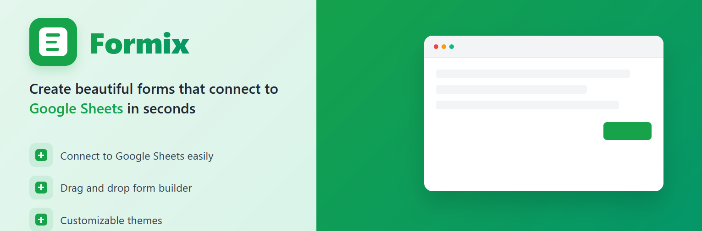

# Form Builder



Form Builder is a powerful, flexible, and easy-to-use tool for creating and managing forms. Built with Next.js and React, it provides a modern drag-and-drop interface for building forms, handling submissions, and exporting data to Google Sheets.

## Features

- **Drag-and-Drop Interface**: Easily create forms with a user-friendly drag-and-drop interface.
- **Customizable Fields**: Add and configure various field types to suit your needs.
- **Google Sheets Integration**: Export form submissions directly to Google Sheets.
- **User Authentication**: Secure user authentication with NextAuth and Prisma.
- **Responsive Design**: Fully responsive design that works on all devices.
- **Real-time Updates**: Instant updates and feedback as you edit your forms.

## Getting Started

### Prerequisites

To get started, ensure you have the following installed:

- Node.js
- npm, yarn, pnpm, or bun
- A Google account for API integration

### Installation

Clone the repository:

```bash
git clone https://github.com/SAMAymen/form-builder.git
cd form-builder
```

Install dependencies:

```bash
npm install
# or
yarn install
# or
pnpm install
# or
bun install
```

### Environment Variables

Create a `.env` file in the root directory and add your environment variables:

```env
DATABASE_URL=your-database-url
GOOGLE_CLIENT_ID=your-google-client-id
GOOGLE_CLIENT_SECRET=your-google-client-secret
NEXTAUTH_URL=your-nextauth-url
```

### Running the Development Server

Start the development server:

```bash
npm run dev
# or
yarn dev
# or
pnpm dev
# or
bun dev
```

Open [http://localhost:3000](http://localhost:3000) with your browser to see the result.

## Usage

### Creating a Form

1. Navigate to the form builder interface.
2. Drag and drop fields to create your form.
3. Customize each field using the settings panel.
4. Save your form and share the generated code to embed it in any website.

### Managing Submissions

1. View form submissions in the dashboard.
2. Export submissions to Google Sheets with a single click.

## Learn More

To learn more about Next.js and other technologies used in this project, take a look at the following resources:

- [Next.js Documentation](https://nextjs.org/docs) - Learn about Next.js features and API.
- [Learn Next.js](https://nextjs.org/learn) - Interactive Next.js tutorial.
- [Prisma Documentation](https://www.prisma.io/docs) - Database ORM for Next.js.
- [NextAuth.js Documentation](https://next-auth.js.org/getting-started/introduction) - Authentication for Next.js.

## Deployment

The easiest way to deploy your Next.js app is to use the [Vercel Platform](https://vercel.com):

1. Push your code to GitHub.
2. Sign in to Vercel and import your repository.
3. Follow the prompts to deploy your app.

For more details, check out the [Next.js deployment documentation](https://nextjs.org/docs/app/building-your-application/deploying).

## Contributing

We welcome contributions! Please read our [contributing guidelines](CONTRIBUTING.md) for more information.

## License

This project is licensed under the MIT License. See the [LICENSE](LICENSE) file for details.

## Acknowledgements

- [Next.js](https://nextjs.org) - The React Framework.
- [Prisma](https://www.prisma.io) - Next-generation ORM for Node.js & TypeScript.
- [NextAuth.js](https://next-auth.js.org) - Authentication for Next.js.
- [Google APIs](https://developers.google.com/apis-explorer) - Access Google services programmatically.

Happy building!